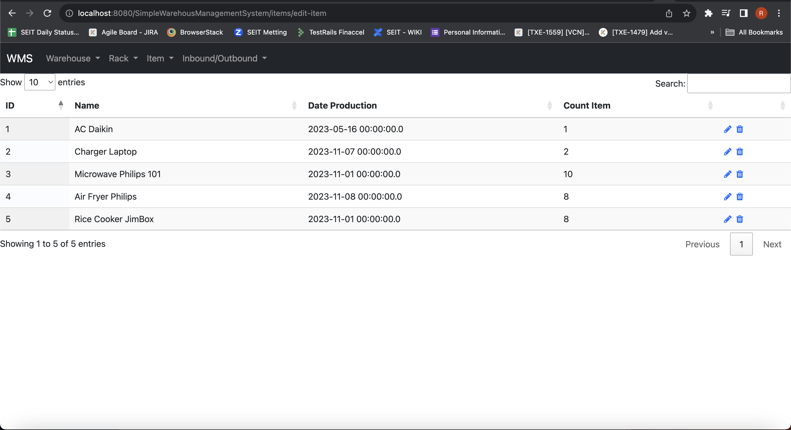

# SimpleWMS
  - Simple Warehouse management system with features:
    - warehouse management
    - item management
    - inbound and outbound item
    - rack storage item management
  - Tech stack
    - Servlet
    - JSP
    - Java
    - Mysql
    - JDBC
    - JQuery
    - Datatable javascript
    - Sweet alert
    - Hibernate
  - Screenshoot apps 
    - dashboard
    		- 
    	- list warehouse
    		- 
    	- input warehouse
    		- 
    	- input rack
    		- 
    	- list rack
    		- 
    	- input item
    		- 
    	- list item
    		- 
    	- list inbound outbound
    		- 
    	- input inbound
    		- 
    	- input outbound
    		- 
  	 